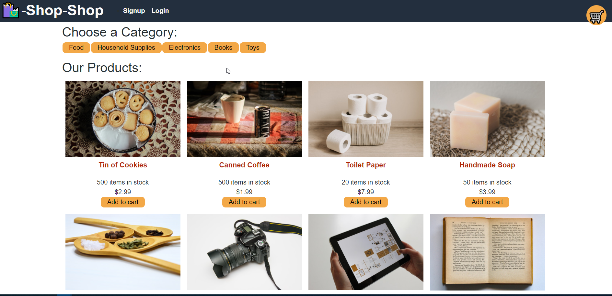

# Redux Store
Challenge was to refactor the Shop-Shop online store from Context-API to Redux

## Authors

- [@jshallcross](https://www.github.com/jshallcross)

  
## License

[MIT](https://choosealicense.com/licenses/mit/)

  
## Screenshots

  
## Tech Stack

**Client:** React, Redux

**Server:** Node, Express

  
## Badges

  
## Live Site

https://blooming-temple-28297.herokuapp.com/

  
## Contributing

Starer code was provided by University of Toronto Coding Boot Camp

  
## Features

- Login / Sign up
- PWA
- Stripe allows fake transactions

  